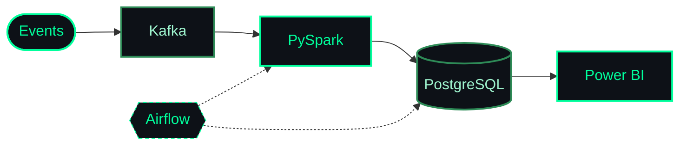

 

&nbsp;&nbsp;
&nbsp;&nbsp;
&nbsp;&nbsp;
&nbsp;&nbsp;

📫 <b>aliraza.141@outlook.com</b>

 

 

```mermaid
flowchart LR
    A([Events]):::a --> B[Kafka]:::b
    B --> C[PySpark]:::a
    C --> D[(PostgreSQL)]:::b
    D --> E[Power BI]:::a
    G{{Airflow}}:::c -.-> C
    G -.-> D
    classDef a fill:#0d1117,stroke:#00ff9c,stroke-width:2px,color:#00ff9c
    classDef b fill:#0d1117,stroke:#2e8b57,stroke-width:2px,color:#9ff5cf
    classDef c fill:#0d1117,stroke:#00ff9c,stroke-dasharray:4 3,color:#00ff9c
```

 

 

  

 

